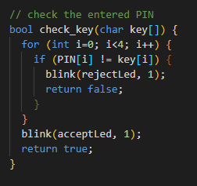

# How the attack works

A quick explanation how the attack works.

### how it works
An up to 10 digit pin is entered on the keypad, to check if entered correctly the # is pressed. The yellow LEDs will light up when detecting the press of this button to confirm the entry. If the pin is correct the green LED will flash, if not the red one will do so. After the optical feedback you can enter again.
To delete the digits already input (before checking) use the * button to delete all digits (flush the buffer). You can also see the I/O on the serial console when connected via COM port.

Use the Arduino IDE to upload the .ino file to your microcontroller. You can get it [here](https://www.arduino.cc/en/software),

**the vulnerability**  
Sound fine, how is this vulnerable now? The problem is based on the implementation of the pin ckeck. It looks something like this: 

Can you see it? The pin gets checked digit by digit and the reject (red) LED lights up right in them moment when a difference to the correct pin is detected. The problem is, that the time varies depending on how many digits are correct. If the first digit is correct but the second isn't the LED will light up slightly later that when all digis are wrong. We are talking about micro seconds of course, this is not visible to the bare eye but it sould be there in theory.

**the attack**  
We need to very precisely measure the time from the input of the last digit to the output on the red led. To achive this we first need a trigger to measure from, this one needs to reliably at the right time every execution (relatively) cause we take it a a reference. Beacause we are delaing with manual input the enter key (#) is perfect for us. To make the wireing and configuration a bit easyer we can take the yellow LED but the two wires from the matrix would be good as well. The other sample point we need to measure is the red LED.

A logic analyser can be used to measure if pins are high or low, think of it as a very precise digital oscilloscope we can interface and measure with in software. I use Logic 2 software from SALEAE, it even works with very cheap logic analysers (like mine) and has a ton of features.  
https://www.saleae.com/de/downloads/

**step by step**  
The progress to measure the time delta:
- start the measurement in Logic, it will wait for the trigger
- enter a pin and press # (enter)
- add a measurement from the trigger to the rising edge of the red LED (in Logic) to see the time delta

The attack would look like this:
- determine the **base time delta** by inputing some random values and calculating the average time the red LED light up
- start entering pins systematially by only changing the first digit of the entered pin and writing down the time deltas measured (0000, 1000, 2000, 3000, ...)
- if the time is larger than the other ones you know this digit is correct and you can move to the next one and repeat the steps until you 'guessed' the whole pin